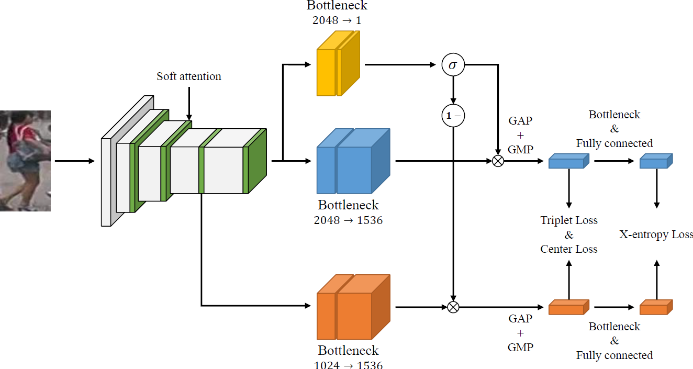

# Mask Separated feature learning for person Re-Identification

A simple but effective structure for person re-identification.


## Architecture


## Requirements
We use the 'amp' package which supports automatic mixed precision. You can downloads the package in [here!](https://github.com/NVIDIA/apex)

After install amp, 
```
$ conda create -n msreid python==3.7 -y
$ conda install pytorch torchvision cudatoolkit -c pytorch
$ pip install -r requirements.txt
```


## Results (Rank-1/mAP)

|    Dataset    | Rank-1/mAP  | ckpts  |
| :-----------: | :---------: | :----: |
|  Market1501   | 96.1%/88.9% |  [file](https://www.dropbox.com/s/98v7d4cy5n17qt9/market1501_ALM_resnet50_model_best.pth.tar?dl=0)  |
| DukeMTMC-reID | 90.2%/80.6% |  [file](https://www.dropbox.com/s/x0dt1n2q3aljqcn/dukemtmc_ALM_resnet50_model_best.pth.tar?dl=0)  |
|   CUHK03-L    | 86.1%/83.0% |  [file](https://www.dropbox.com/s/ur4es2ngbs5bh3s/cuhk_L_ALM_resnet50_model_best.pth.tar?dl=0)  |
|   CUHK03-D    | 84.2%/80.3% |  None  |
